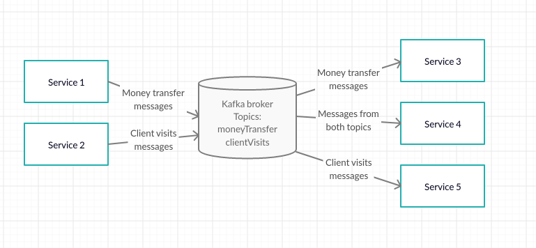

### Apache Kafka for begginers

This article is brief and abstract overview of how `Apache Kafka` works.

#### What is `Apache Kafka`?
`Apache Kafka` is a message broker.
What is message broker and do we need it? Why choose `Kafka` and not some other message broker like `ActiveMQ`, `RabitMQ` or some other?
You can find answers to those questions here and here. In this article we will assume that we do need broker and we chose `Apache Kafka`.

#### How `Kafka` works?
There are 3 important components in `Apache Kafka`:
- Brokers
- Producers
- Consumers

#### How Publish/Subscribe works and why we need topics?
As you can assume producers are producing messages to brokers and consumers are consuming messages from brokers.
Let's imagine simple banking application (shown in an picture) example so we can easier understand some new concepts.
Banking application is divided into 5 services.
`Service 1` is producing messages related to money transfer, `Service 2` is producing messages related to which links bank clients are
visiting, `Service 3` is consuming messages related to money transfer `Service 4` is consuming messages from both topics and `Service 5` is consuming messages related to what bank clients visit.
Note: One service can be both consumer and producer in the same time and kafka can have more than one broker but for the sake 
of the simplicity I chose this example.

 
You can assume that since every consumer can choose subset of messages from broker, we should separate
messages on broker somehow. That is the reason why `topic` exist. This means that producers will send messages that are related to money transfer to topic named `moneyTransfer` and messages related to client visits will be sent to topic `clientVisits`. On the other hand, consumers will subscribe themselfs onlt to topics in which they are interested in. Important thing to understand here is that `topic` does not work like a `queue`. In `queue` if one consumer receive message from broker, no else consumer will ever receive that same message. In `Kafka`, `n` consumers can subscribe to topic and all of them will receive message.

#### What happens if consumer is temprorary down, are we gonna miss messages?
Fortunately, we are not gonna miss any messages. `Kafka` keep messages in broker before deleting it. In case that our consumer was temporary down, we can recconect to kafka broker and keep reading messages.

#### How consumer knows where to continue reading when recconect?
If there are 200 messages in broker and our consumer already read 100 messages, we would like to continue from 101th record, not from the beggining. For this purpose consumer must notify broker which messages he read already. From time to time, we notify broker "I processed 70th message for topic `moneyTransfer` ". When our consumer recconects, he can ask broker "Hey what is the last record that I processed before I crashed? This number "last record which I processed" is called `offset`. Actually, we remember `offset` per `partition` and not per `topic`. Let's see what is `partition`.

#### What are partitions and why do we need them?
Our application is successfull but still we see that our consumer read messages very slow. We would like to speed up our consumer somehow. Can we speed up consuming if we add new consumer? Two consumers will read messages much faster than one. Fortunately, this is possible. One consumer should read one subset of `topic` and second consumer should read second subset of `topic`. We see that we should split our `topic` on some subsets. And this is actually possible in `Kafka`. We split `topic` into `partitions`. As you can guess if we have five partitions it have sense to have two consumers(in this case one consumer will consumer two partitions and the other one will consume 3 partitions) but there is no sense having more than five consumers.

#### `Apache Kafka` docs say that `Kafka` is distributed system. What that means?
We can store kafka messages on multiple brokers(as you can see from the picture every broker contains two partitions).
This way kafka distributed partitions among brokers.

#### What happens if one of brokers become unavailable?
Are we gonna loose all messages from partitions that are placed on that broker? Fortunately, we can configure `Kafka` so we can be sure that we will not loose messages. We can replicate partitions on multiple brokers. For example, if we configure `replication factor` to be `3` we will have 3 copies of every partition on our brokers. Sure, this introduced some redundancy but that is the price of being fault tolerant.
