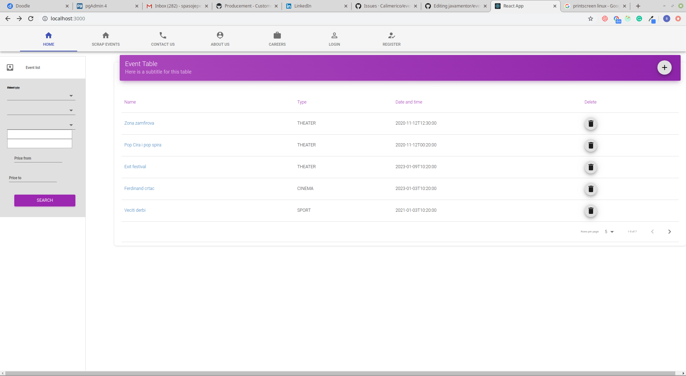

### Eventify specifikacija

Ja sam uradio nesto tj prekopirao sa neta malo odavde i 
odande pa cu ti ubaciti skrinshotove kako to izgleda
cisto da bi imao ideju sta pokusavam da napravim.
To sto sam napravio izgleda dosta lose pa mi je zato potrebna pomoc.

To odprilike ovako nekako izgleda:

Ako gledamo samo layout ja mislim da je ovo sa menijem gore, levo i glavnim sadrzajem dobra 
stvar ali nekako ruzno izgleda jer mozda ja nisam lepo odradio margine,
 proporcije, centriranje ili stagod. Ako mislis da postoji bolje resenje, 
 moze da se uradi i drugacije.

Ovaj meni gore mozda i nije toliko los, mozda samo da se centriraju itemi i to je to.

Forma levo sluzi da uneses filtere i kad kliknes search, u tabeli ti se prikazu
samo oni eventi koji zadovoljavaju kriterijum. Generalno treba da ima jedna forma koja sadrzi 
neka prosta polja poput datepicker-a, text input, select, checkbox i tako to. Deluje mi 
od svih nabrojanih da je date picker najzahtevniji ali verujem da postoji neki online koji moze
da se samo prekopira i da to izgleda manje vise lepo. 

Tabela je manje vise funkcionalna, jedino sto je lose je sto vidis dole kod navigacije kako su mala
slova, to treba da se poboljsa. Kad se klikne na ovaj plusic u ljubicastom divu, 
treba da se otvori kao dijalog forma za insertovanje eventa(super bi bilo kad bi mogla da se reusuje ova sto smo je
koristili za filtere samo da ubacimo druga polja)

Kad se udje u jedan od evenata, treba neka strana na kojoj se lepo prikazuju neki atributi.

Ti atributi nisu neki komplikovani nego npr: jedna slika eventa(nesto kao profilna), ime eventa, description, kad se odrzava, gde se odrzava itd...

Tu istu formu gde prikazujem event, mogu da iskoristim i za prikaz user-a, samo da promenim polje.

Na toj formi za prikaz eventa treba da postoji edit dugme koje kad kliknem otvara se forma za edit(opet mozemo da reusujemo onu formu sa pocetka)

Znaci u sustini ono sto mi treba je jedan lep layout gde kad ubacim u taj layout glavni sadrzaj, footer ili menije da se oni lepo rasporede.

Jedna lepa forma za edit gde mogu da editujem jednostavna polja po zelji.

Jedna lepa forma za prikaz jednostavnih polja po zelji.

Malo lepsi meni.

Normalna tabela sa navigacijom.

Treba mi samo dizajn, ja cu uraditi reducere,akcije, selektore itd.

To je to. :)