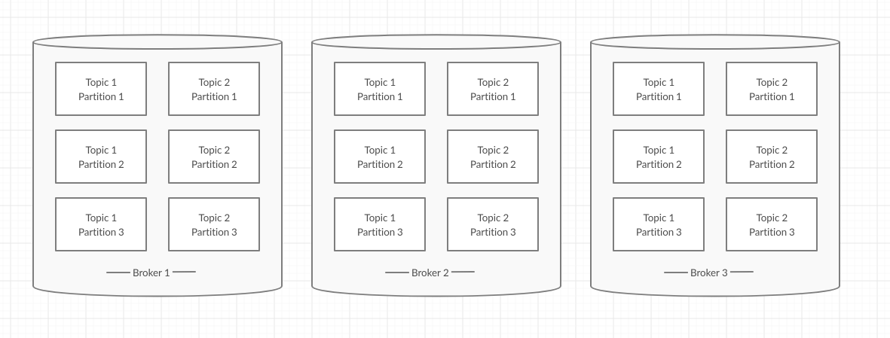

#### How to setup `Apache Kafka` on your machine

In this article we will cover:
- Start brokers, producers and consumers
- Produce and consume messages
- Include more than one broker
- Check if kafka is really fault tolerant by killing one broker 

##### Download kafka

First of all, we need to download kafka [here](https://kafka.apache.org/downloads). In the time of writing this article, newest version of kafka is `2.4.0` but if there is newer version available, you can download newer version as well.

After downloading, extract that file and go into that directory.

```
 tar -xzf kafka kafka_2.13-2.4.0.tgz
 cd kafka_2.13-2.4.0
```
##### Start zookeper

Before starting `kafka` you should have `zookeper` started.
Start `zookeper` with command:

`bin/zookeeper-server-start.sh config/zookeeper.properties`

##### Start kafka broker

You are ready to start kafka `broker`. Open new terminal window and type:

```
bin/kafka-server-start.sh config/server.properties
```

As you can assume, if you want to change some config related to broker, you should create new `server.properties` file(as we can see later in this post)

#### Create topic, consumers and producers

Create topic:

```
bin/kafka-topics.sh --create --bootstrap-server localhost:9092 --replication-factor 1 --partitions 1 --topic topicName
```

As you can see you are creating topic called `topicName` with `1` partition and replication factor of `1`.With `bootstrap.server` property you specify list of brokers where kafka client can find information about cluster. So in this case we specify address of our only `broker`.

Ok, since `broker` is up and running, we need to create some producers and consumers.
Start producer and send few messages:
```
> bin/kafka-console-producer.sh --broker-list localhost:9092 --topic topicName
> This is a message
> This is another message

```
As you can see, in terminal you can type some messages that will be sent to kafka `broker`.

Start consumer:

```
bin/kafka-console-consumer.sh --bootstrap-server localhost:9092 --topic topicName --from-beginning
```

This will read all messages from topic `topicName`.

#### Starting more than one broker

You learned that data from one topic is partitioned and replicated among many brokers so you would like to check that.
You would like to split `topic` into `3` partitions and replicate it `3` times. You will end up with this picture:


Create two new config files for our two new brokers:

```
 cp config/server.properties config/server-a.properties
 cp config/server.properties config/server-b.properties
```

In newly created `server.properties` files, you should edit `broker.id` , `listeners` and `log.dirs` properties. 
Something like this will work:

For `server-a.properties`:
```
broker.id=1
    listeners=PLAINTEXT://:9093
    log.dirs=/tmp/kafka-logs-a
```

`server-b.properties`
```
broker.id=2
    listeners=PLAINTEXT://:9094
    log.dirs=/tmp/kafka-logs-b
```

**Note** Those properties already exist in server.properties files so make sure that you edit values of those properties
and not just paste this code at the end of those properties files.
Start 2 new brokers:

```
bin/kafka-server-start.sh config/server-a.properties
bin/kafka-server-start.sh config/server-b.properties
```
Since now we have two new brokers up(with one that we already started before), we have 3 brokers up now and we can try to create topic with 3 partitions and replication factor of 3.

#### Start replicated and partitioned topic

```
bin/kafka-topics.sh --create --bootstrap-server localhost:9092 --replication-factor 3 --partitions 3 --topic replicated-partitioned-topic
```

Wow, that was easy. Now, you may wonder why we just specified `localhost:9092` and we didn't include other 2 brokers. But the thing is our client(in this case `kafka-topics.sh` script) will go to `localhost:9092` and ask: "Hey, I need to create replicated topic on your cluster, can you give me more info about cluser(including all brokers in it)". That way, client will know addresses of all brokers.

#### Find more details about your topic

First of all, you would like to check on which brokers you can find data about your topic:

```
bin/kafka-topics.sh --describe --bootstrap-server localhost:9092 --topic replicated-partitioned-topic
```
Output is similar to this:

```
Topic: replicated-partitioned-topic	PartitionCount: 3	ReplicationFactor: 3	Configs: segment.bytes=1073741824
	Topic: replicated-partitioned-topic	Partition: 0	Leader: 2	Replicas: 2,1,0	Isr: 2,1,0
	Topic: replicated-partitioned-topic	Partition: 1	Leader: 1	Replicas: 1,0,2	Isr: 1,0,2
	Topic: replicated-partitioned-topic	Partition: 2	Leader: 0	Replicas: 0,2,1	Isr: 0,2,1

```
If you don't know what is leader, in sync replica, how replication works in details and you would like to learn more about it, check this article.

Without goind into so many details:
- Leader: Broker responsible for all read and writes for particular partition
- Replicas: Brokers on which we can find replica of our partition
- In sync replica: Replica that replicated all mesagges of the leader

This output translated to human language say: "Leader broker for partition 0 is broker with id 2. Replicas of this partition can be found on brokers with ids 2,1,0. In sync replicas(Isr) can be found on brokers with ids 2,1,0". That is translation for the first line of the output. It goes the same way for other two lines.

#### What happens when one broker is dead?

Let's kill one of the brokers(easiest way is to close your terminal window where you started that broker) and run again that command to describe topics.
Now output should look similar to this:
```
Topic: replicated-partitioned-topic	PartitionCount: 3	ReplicationFactor: 3	Configs: segment.bytes=1073741824
	Topic: replicated-partitioned-topic	Partition: 0	Leader: 2	Replicas: 2,1,0	Isr: 2,0
	Topic: replicated-partitioned-topic	Partition: 1	Leader: 0	Replicas: 1,0,2	Isr: 0,2
	Topic: replicated-partitioned-topic	Partition: 2	Leader: 0	Replicas: 0,2,1	Isr: 0,2
```
Now since I killed broker with `broker.id=1` broker with id 0 took leadership over partition 0. This proofs that our kafka cluster is fault tolerant. We killed our broker but we haven't lost any data, everything is fine.

That would be it
