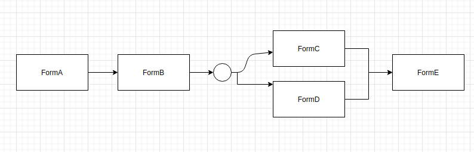

### State pattern - real world example

##### Table of Contents


[Explanation of the pattern](#state-pattern-explanation)  
[Example](#example)  
[Conclusion](#conclusion)  

<a name="state-pattern-explanation"/>

#### Explanation of the pattern

Core idea of the state pattern is that **object change behaviour based on his state**. We will show, how it works on the example.

<a name="example"/>

#### Car insurance example

Let's say that you are working in the car insurance company and this is your requirement: 

We are creating damage processor service. Whenever our customer have an accident, he came to our app and fullfill some forms in some specific order to be able to get his money(something like wizard windows). 
Here is an image that explains in which order client need to submit those forms:




We first need to populate formA, then formB, then C and D(C and D order is not important but it must be before formE) and then finally formE.

This state machine problem is ideal for our state pattern. Let's see the code:

**Person** class:

```
public class Person {
    private PersonState state = new PersonStateA();
    private final Set<Form> submittedForms = new HashSet<>();

    void submitForm(Form form) {
        state.submitForm(form, this);
    }

    public Set<String> formsForSubmitting() {
        return state.formsForSubmitting();
    }

    public Set<Form> getSubmittedForms() {
        return submittedForms;
    }

    public void setState(PersonState state) {
        this.state = state;
    }

    public boolean formsCandDSubmitted() {
        return submittedForms
                .stream()
                .filter(form -> form.getClass().getSimpleName().equals(FormC.class.getSimpleName()) || form.getClass().getSimpleName().equals(FormD.class.getSimpleName()))
                .count() == 2L;
    }
}
```
`Person` has information about it's state and also about all submitted forms. `PersonState` takes care about which form can be submitted currently and which can't.

**PersonState**

```
public interface PersonState {
    void submitForm(Form form, Person person);
    Set<String> formsForSubmitting();
    PersonState nextState();
    PersonState prevState();
}
```
Very intuitive. Methods for moving through states back and forth `nextState` and `prevState`. `formsForSubmitting`
is info which forms can be submitted while in this state and `submitForm` is for submitting forms.

```
public class PersonStateA implements PersonState {

    @Override
    public void submitForm(Form form, Person person) {
        if (formsForSubmitting().contains(form.getClass().getSimpleName())) {
            person.getSubmittedForms().add(form);
            person.setState(nextState());
        } else {
            throw new IllegalArgumentException(
                    "Form of type " + form.getClass().getSimpleName() +
                            " cannot be submitted in state " + this.getClass().getSimpleName() +
                            "Forms that can be submitted are: " + formsForSubmitting()
            );
        }
    }

    @Override
    public Set<String> formsForSubmitting() {
        Set<String> forms = new HashSet<>();
        forms.add(FormA.class.getSimpleName());
        return forms;
    }

    @Override
    public PersonState nextState() {
        return new PersonStateB();
    }

    @Override
    public PersonState prevState() {
        return null;
    }
}
```
You submit form only if client provided right type of form. If he provided wrong form based on current state(for example he cannot submit formE before formB), you throw him an exception.
Implementation is very similar for all of the others states. I will just show one more since they are all almost the same:
```
public class PersonStateCD implements PersonState {

    @Override
    public void submitForm(Form form, Person person) {
        if (formsForSubmitting().contains(form.getClass().getSimpleName())) {
            person.getSubmittedForms().add(form);
            if (person.formsCandDSubmitted()) {
                person.setState(nextState());
            }
        } else {
            throw new IllegalArgumentException(
                    "Form of type " + form.getClass().getSimpleName() +
                            " cannot be submitted in state " + this.getClass().getSimpleName() +
                            "Forms that can be submitted are: " + formsForSubmitting()
            );
        }
    }

    @Override
    public Set<String> formsForSubmitting() {
        Set<String> forms = new HashSet<>();
        forms.add(FormC.class.getSimpleName());
        forms.add(FormD.class.getSimpleName());
        return forms;
    }

    @Override
    public PersonState nextState() {
        return new PersonStateE();
    }

    @Override
    public PersonState prevState() {
        return new PersonStateB();
    }
}
```
Here, you need additional check to see if both C and D forms are submitted before proceeding to next state.

<a name="conclusion"/>

#### Conclusion

Notice in the example that if you add new state, add new rules about behaviour of the `Person` based on `PersonState`, you don't need to touch `Person` class.
 Also, your logic how `PersonState` influence behaviour of the `Person` is inside `PersonState`, not inside the `Person`. 
 In this use case, you have only one state (you take person through damage wizard) but in reality you can take him through many other wizards
 (for example, he can buy different kinds of insurance through wizards). If you introduce new wizards(new state), you don't need to touch your current state about damages, just create new one.
 That is great thing! Your unrelated states are decoupled one from another. Then in the future if you need to change something related to damage state, you will touch `PersonState` and be sure that you didn't screw up type of insurance your client bought.


